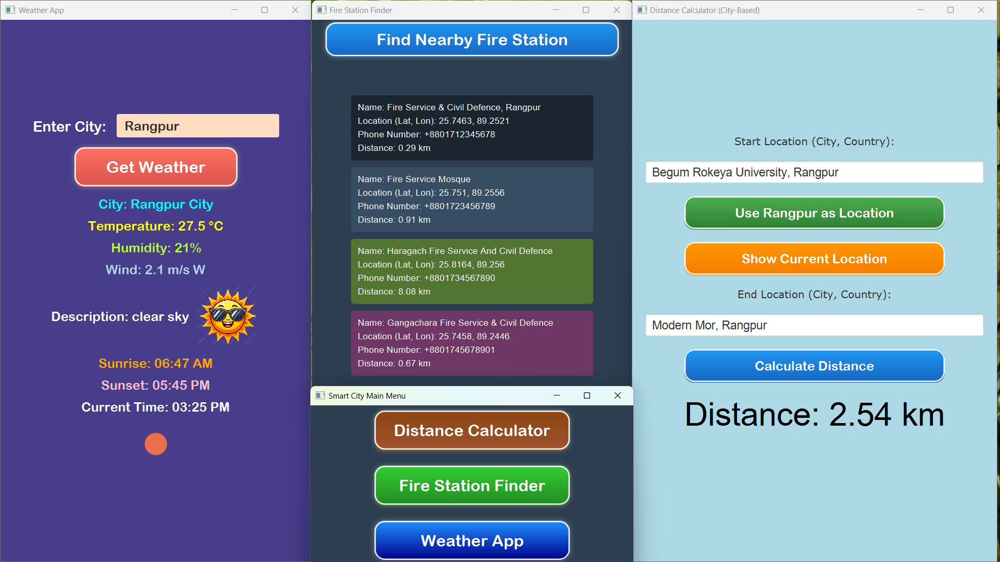
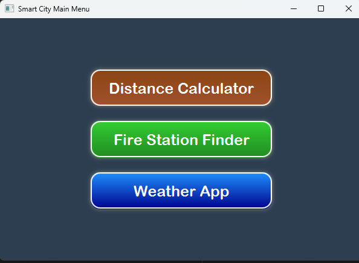
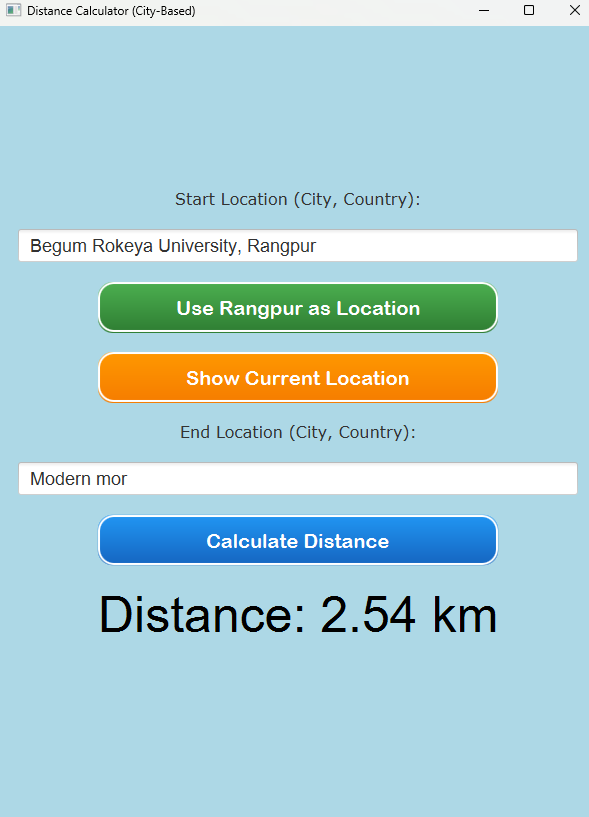
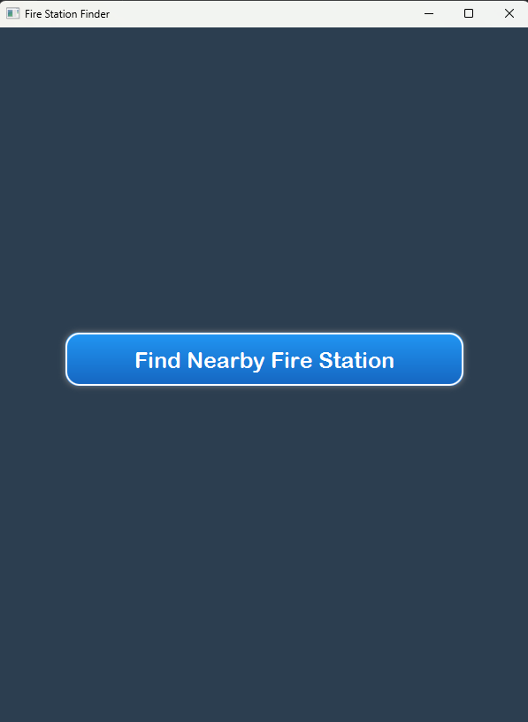
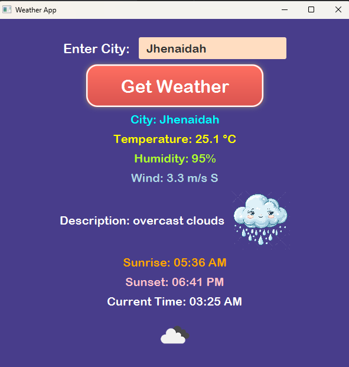

# 📱Smart City Toolkit — JavaFX-Based Smart City Utility Suite
---

<p align="center">
  
  
</p>
<p align="center">
  
  
</p>
<p align="center">
  
</p>

---

##  Project Overview

**Smart City Toolkit** is a modular **JavaFX desktop application** that brings essential urban utilities to your fingertips—all packaged in one sleek, **offline-capable app**. Built with JavaFX 17+, this toolkit includes:

- **Distance Calculator** — Calculate distances between cities, with live map previews  
- **Fire Station Finder** — Locates nearby fire stations using local geospatial data  
- **Weather App** — Retrieve and display real-time weather using the OpenWeatherMap API  

Whether you're a developer exploring desktop UI, a student learning JavaFX, or a user expecting reliable, offline-ready tools—the Smart City Toolkit covers you.

---

##  Highlights & Feature Deep Dive

###  Feature Set
- **Distance Calculator**  
   - Input start and end cities  
   - Option for default Rangpur or Begum Rokeya University locations  
   - Computes Haversine distance; displays a dynamic Yandex map  

- **Fire Station Finder**  
   - Uses local `rangpur_firestations.json` data  
   - Calculates real-time distance to each station  
   - Displays name, location, phone, and distance with animated UI blocks  

- **Weather App**  
   - Integrates OpenWeatherMap API  
   - Shows temperature, humidity, wind info, sunrise/sunset, current time  
   - Weather icons and emoji-style visuals help readability  

###  UI & UX
- Clean and consistent **gradient-style layout**  
- Animated buttons (hover scale effects) with drop-shadow polish  
- Responsive **VBox**, **GridPane**, and **Fade + Scale transitions** for micro-interaction feel  

###  Architecture & Design
- Modular structure with three independent JavaFX `Application` classes  
- Styled components via dynamic CSS-like JavaFX code  
- Local JSON parsing supported using `json-20250107.jar`, a trusted reference implementation for JSON—no bundled external dependencies required :contentReference[oaicite:1]{index=1}  

---

##  Installation & Setup

### Prerequisites
- **Java JDK 17+** installed  
- **JavaFX SDK** added to project/module path  
- JSON library: include `json-20250107.jar` from the **lib/** directory

### Run Locally
1. Clone the repository:
   ```
   git clone https://github.com/CodderPrince/Smart_City.git
   cd Smart_City
    ```

2. Import into your favorite Java IDE (IntelliJ/Eclipse), configure JavaFX and library dependencies.
3. Run the main app via:

   ```java
   package com.example.smartcity.SmartCity
   ```
4. Or compile & run via command line, making sure to include JavaFX and JSON jar paths.

---

## File & Resource Structure

```
Smart_City/
├── src/
│   └── com/example/smartcity/
│       ├── SmartCity.java
│       ├── DistanceCalculatorCity.java
│       ├── FireStationApp.java
│       ├── WeatherApp.java
│       └── util classes...
├── lib/
│   └── json-20250107.jar
├── resources/
│   ├── rangpur_firestations.json
│   └── weather-icons/*.png
├── UI/
│   └── *.png (screenshots)
└── README.md
```

---

## Why JavaFX & Why This Toolkit

* **Cross-platform GUI**: JavaFX is a modern, open-source toolkit that works across Windows, macOS, and Linux ([Wikipedia][1])
* **Robust Java Ecosystem**: Java ensures portability, security, and access to extensive libraries—ideal for smart city development ([MoldStud][2])
* **Offline-first architecture**: No internet needed for Fire Station or Distance modules—great for low-connectivity environments
* **Educational Value**: Learn modular app design, API interaction, JSON parsing, and responsive JavaFX design

---

## Roadmap & Future Ideas

* Add **offline caching** for the weather component
* Integrate **local database** support for persistence
* Incorporate **search/autocomplete** for cities
* Enhance Fire Station Finder with actual mapping or geolocation
* Implement **multilingual UI support** for global reach

---

## License & Acknowledgements

**License:** This project is MIT-licensed—see the LICENSE file for details.

**Special thanks**:

* JavaFX community and Oracle for the platform
* stleary/JSON-java for the JSON library implementation ([GitHub][3])
* OpenWeatherMap for weather data API integration

---

## Author & Contributions

**Md. An Nahian Prince**

* Dept. of CSE, Begum Rokeya University, Rangpur
* GitHub: [CodderPrince](https://github.com/CodderPrince)

Contributions welcome—fork, improve modules, and show off your JavaFX skills!

---

*Thank you for exploring the Smart City Toolkit — where desktop meets city intelligence.*

[1]: https://en.wikipedia.org/wiki/JavaFX?utm_source=chatgpt.com "JavaFX"
[2]: https://moldstud.com/articles/p-the-influence-of-java-software-engineering-in-smart-cities?utm_source=chatgpt.com "The Role of Java Software Engineering in Building Smarter Cities"
[3]: https://github.com/stleary/JSON-java?utm_source=chatgpt.com "A reference implementation of a JSON package in Java. - GitHub"
